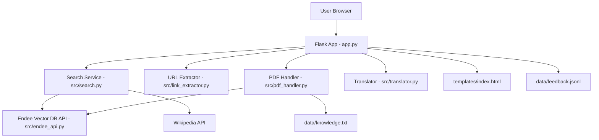

# AI Knowledge Assistant

AI Knowledge Assistant is a Flask-based app that lets you search across local notes, uploaded PDFs, and online knowledge in one place.

It is designed to be simple to run, easy to understand, and practical for day-to-day use.

Demo Video: Add your hosted demo link here (Google Drive/YouTube)

## Internship Compliance (Mandatory)

For Endee ML Intern evaluation, keep these steps completed and visible:

- Star the official Endee repository: https://github.com/endee-io/endee
- Fork the official Endee repository to your GitHub account
- Build and submit from the forked base repository workflow
- Submit your final GitHub project link in the application form

Recommended proof for evaluators:

- Keep fork relationship visible on GitHub
- Mention Endee usage clearly in this README
- Include setup + run steps that work end-to-end

## Problem Statement

Information is often scattered across local notes, PDFs, and web pages, making it difficult to retrieve accurate answers quickly.

Traditional keyword search usually misses context and intent, especially when users ask natural-language questions.

This project solves that problem by combining vector-based retrieval with a simple user-facing workflow, so users can search heterogeneous sources and get ranked, relevant answers.

## What You Can Do

- Ask natural-language questions and get top 3 matching answers
- Pick source mode: all, only PDF, or only online
- Upload PDFs and make their content searchable
- Paste any valid URL and extract readable page text
- Review recent searches and URL extractions on the History page
- Browse uploaded documents on the Documents page
- Use JSON API endpoints for search, history, and documents
- Translate answers into multiple languages
- Save answer feedback (like/dislike + optional comment)

## Key Features

### 1. Smart Search with Ranking
- Main search flow is in src/search.py
- Returns top 3 matches with score
- Selects the highest-scoring result as best answer

### 2. Source Control in Search
- Source options available in UI:
  - all: combines local + online
  - pdf: only uploaded PDF data
  - online: Wikipedia-based online search

### 3. URL Content Extraction
- New module: src/link_extractor.py
- Accepts http:// or https:// URLs
- Removes noisy HTML elements (scripts/styles/nav/etc.)
- Extracts readable text and shows it directly in UI

### 4. PDF Knowledge Expansion
- PDF upload route: /upload-pdf
- Uses PyPDF2 for extraction
- Appends extracted content to local knowledge store

### 5. Translation Layer
- Translation helper in src/translator.py
- Supports multiple languages (EN, HI, DE, FR, ES, ZH-CN)
- Uses googletrans, falls back to deep-translator when needed

### 6. Feedback Tracking
- Feedback endpoint: /feedback
- Stores records in data/feedback.jsonl for review/analysis

## Project Flow

1. User enters question or URL in UI
2. Flask route in app.py handles request
3. Search request goes to src/search.py (local/online/PDF logic)
4. URL extract request goes to src/link_extractor.py
5. Result is rendered in templates/index.html

## How Endee is Used (Indexing + Search Flow)

### Indexing Flow
- During ingestion, text content from local knowledge and uploaded PDFs is chunked.
- Chunks are sent to Endee using `store_to_endee()` from `src/endee_api.py`.
- Endee stores vector-ready records that become available for semantic retrieval.

### Search Flow
- For local/PDF retrieval paths, the app uses Endee as the required retrieval backend.
- Query is sent through `search_endee(query, top_k=3)`.
- Endee returns top matches with similarity scores.
- Results are normalized and shown in ranked order in the UI.

### Why Endee Here
- Supports semantic matching over plain keyword matching.
- Improves relevance for natural-language questions.
- Fits the project requirement for vector database-based AI workflows.

## Architecture Diagram



If your Markdown preview does not render Mermaid, use the flow above as the architecture reference.

## Tech Stack

- Backend: Python, Flask
- Data/API: requests, Endee API (required for local/PDF retrieval)
- Parsing: BeautifulSoup4, PyPDF2
- Translation: googletrans, deep-translator
- Frontend: HTML + CSS (Jinja templates)

## Setup Instructions

### 1) Create virtual environment

Windows (PowerShell):
```powershell
python -m venv venv
.\venv\Scripts\activate
```

Linux/macOS:
```bash
python -m venv venv
source venv/bin/activate
```

### 2) Install dependencies
```bash
pip install -r requirements.txt
```

### 3) Environment config
Create .env in project root. Endee is required for local/PDF retrieval modes.

Local Docker mode (recommended for development):

```env
ENDEE_BASE_URL=http://localhost:8080/api/v1
ENDEE_API_KEY=your_api_key_here
ENDEE_INDEX_NAME=ai_knowledge_assistant
ALLOW_MODEL_DOWNLOAD=0
```

Cloud dashboard-visible mode (when your evaluator needs cloud visibility):

```env
ENDEE_BASE_URL=https://api.endee.ai/v1
ENDEE_API_KEY=your_api_key_here
```

### 4) Run the app
```bash
python app.py
```

Open in browser:
http://127.0.0.1:5000

### 5) Run tests
```bash
pytest -q
```

## Quick Validation Checklist

1. Home page opens successfully
2. Search form is visible
3. Extract Content From URL section is visible
4. URL test: https://example.com shows extracted content
5. PDF upload page works
6. Search returns ranked results with score
7. Endee index receives vectors after ingestion/upload

## Submission Checklist (Evaluation)

- Repository is on GitHub and publicly accessible (or shared as required)
- README includes problem statement, architecture, Endee integration, setup, and run instructions
- Project demonstrates one practical AI use case (semantic search/RAG/retrieval)
- Endee is used as the vector database in project flow
- Final repository link is ready to submit

## Test Cases (Pass Results)

| # | Test Case | Expected Result | Status |
|---|-----------|-----------------|--------|
| 1 | Python compile check (`src/search.py`, `src/pdf_handler.py`, `app.py`, `src/endee_api.py`) | No syntax errors | PASS |
| 2 | Home page route test (`/`) | HTTP 200 response | PASS |
| 3 | About and Upload routes (`/about`, `/upload-pdf`) | HTTP 200 responses | PASS |
| 4 | URL extraction flow (`https://example.com`) | Extracted page title/content shown | PASS |
| 5 | Endee-required enforcement for local/PDF retrieval | Clear error if Endee is not configured; Endee path used when configured | PASS |

### Last Verified On

- Date: 2026-04-24
- Method: Flask test client + compile checks

## Important Files

- app.py: main Flask routes
- src/search.py: search logic and ranking
- src/link_extractor.py: URL text extraction
- src/pdf_handler.py: PDF upload and extraction
- src/translator.py: translation handling
- src/endee_api.py: Endee API wrapper
- scripts/fetch_data.py: helper script to fetch seed knowledge
- scripts/embed_store.py: helper script to generate/store embeddings
- templates/index.html: main UI template
- templates/history.html: recent activity view
- templates/documents.html: uploaded PDF list view
- docs/PROJECT_DEVELOPER_MAP.md: architecture and extension guide
- requirements.txt: all Python dependencies

## Project Structure

```text
AI-Knowledge-Assistant/
├── app.py
├── requirements.txt
├── src/
│   ├── endee_api.py
│   ├── link_extractor.py
│   ├── pdf_handler.py
│   ├── search.py
│   └── translator.py
├── scripts/
│   ├── embed_store.py
│   └── fetch_data.py
├── docs/
│   └── PROJECT_DEVELOPER_MAP.md
├── templates/
│   ├── index.html
│   ├── upload_pdf.html
│   ├── documents.html
│   ├── history.html
│   └── about.html
└── data/
    ├── knowledge.txt
    ├── feedback.jsonl
    ├── search_history.jsonl
    └── uploads/
```

## Notes

- Do not commit your .env file
- URL extraction works only for public HTML pages
- Some websites block scraping; in that case extraction may fail gracefully with an error message

## Known Limitations

- Full generative answer synthesis (LLM generation) is not included yet; current flow is retrieval + ranking.
- Online mode depends on Wikipedia API availability.
- Some websites prevent automated scraping, so URL extraction may fail for blocked pages.

## Future Improvements

- Add full RAG generation layer with grounded response prompts.
- Add CI workflow for tests and lint checks on pull requests.
- Add observability dashboard for ingestion/search metrics.
- Add metadata-filtered retrieval in Endee for stricter source-specific search.

## Developer Map

- For a full file connection map and feature/file add checklist, see docs/PROJECT_DEVELOPER_MAP.md.

## Developer

- Name: Yash
- Email: yg8625369@outlook.com

